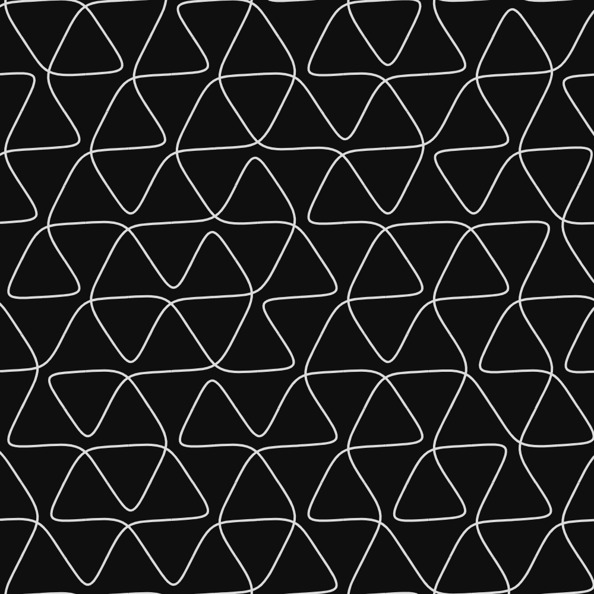
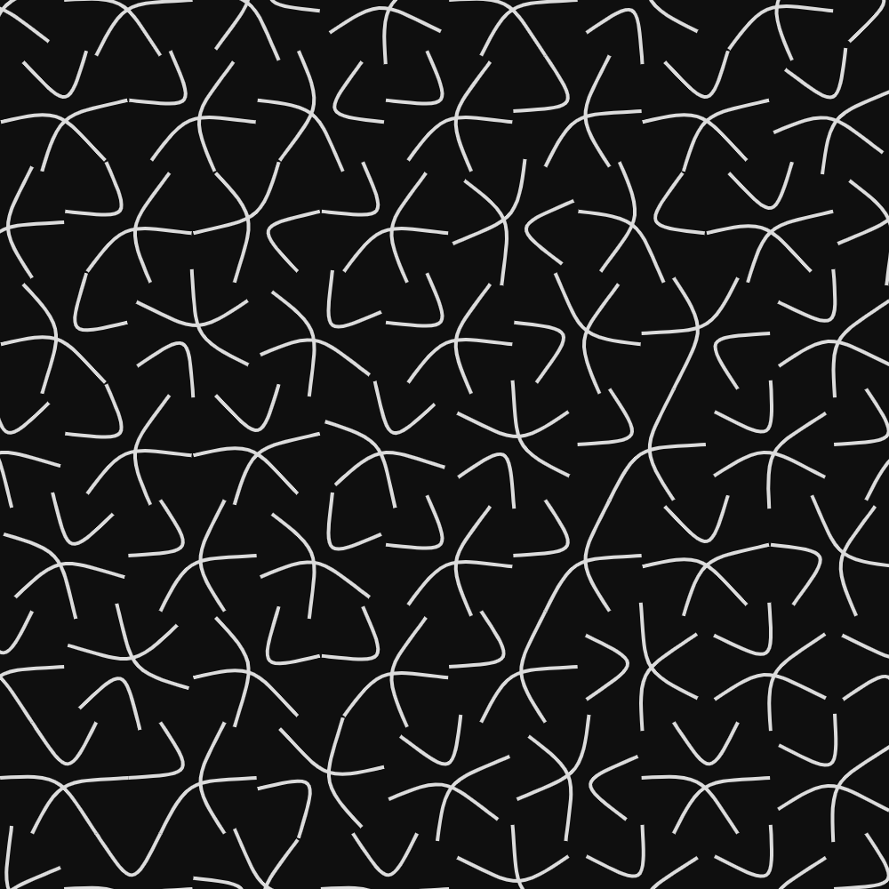
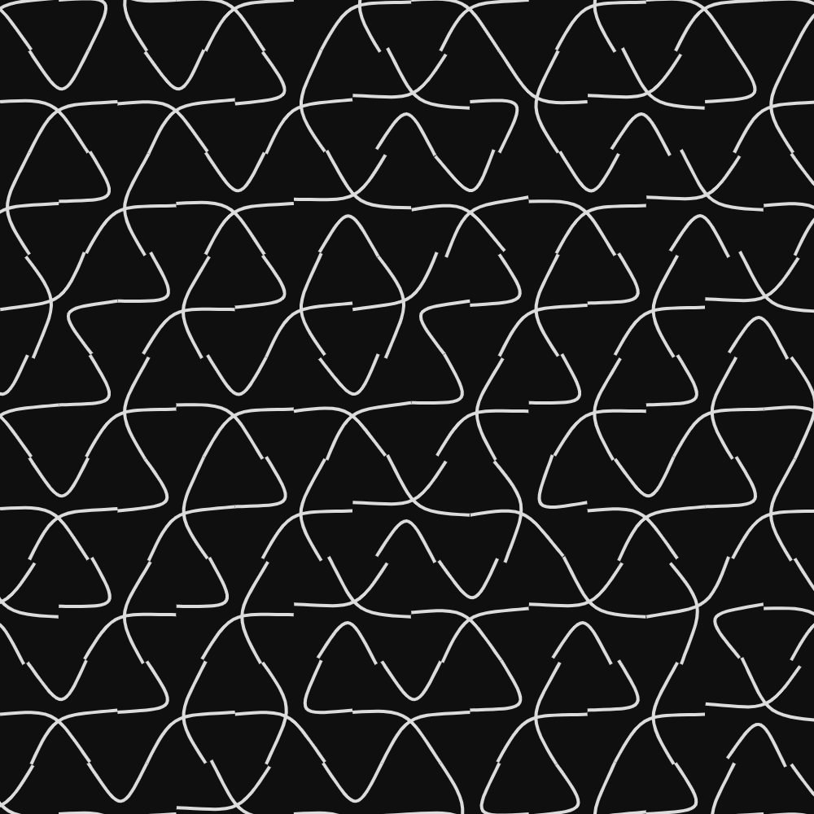
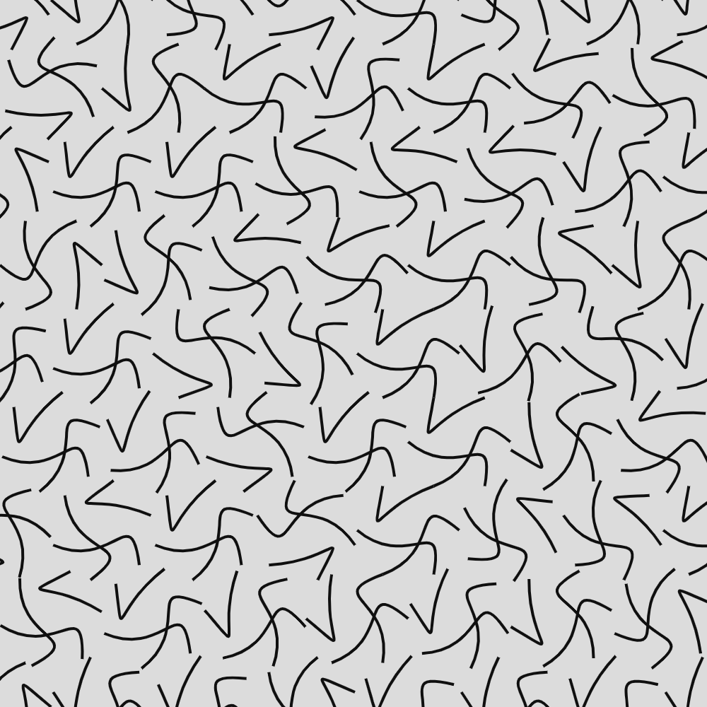
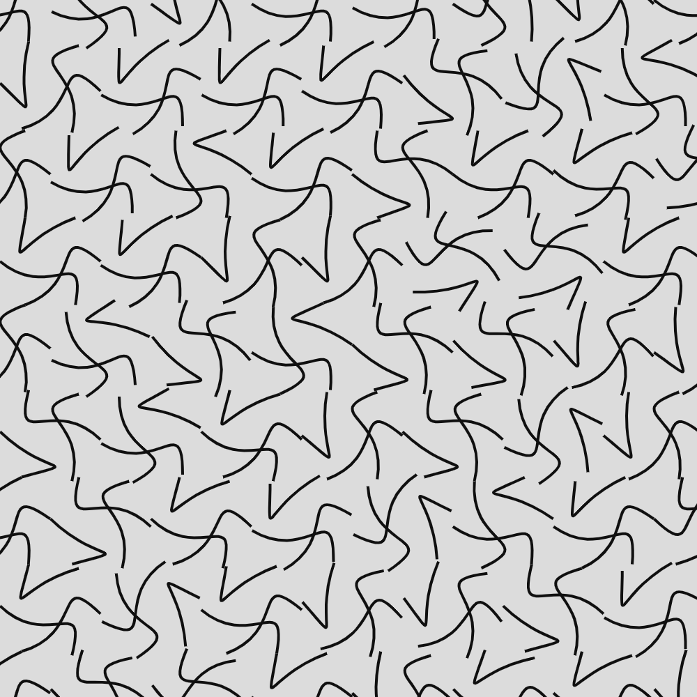
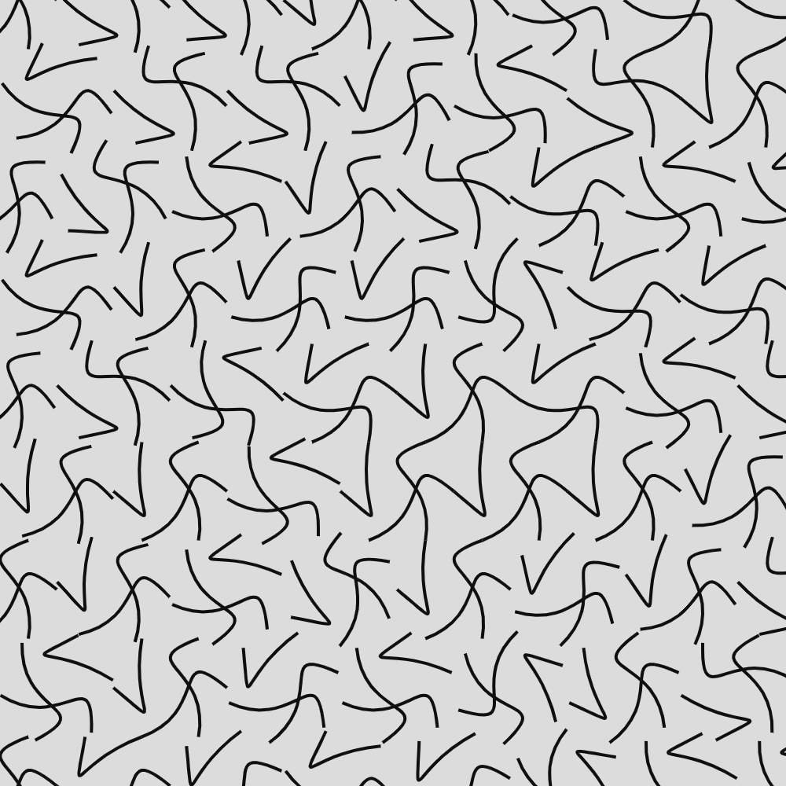

# Hexagons

`Hex... hex!`

## Try it here: [lorenzoros.si/HEXAGONS](https://www.lorenzoros.si/HEXAGONS)

## The idea

Did you know that you can fill a plane just using hexagons? It's one of the few regular polygons (together with squares and triangles) that have this feature. John Conway, the legendary British mathematician who also invented Game of Life, called a plane divided into hexagons a *hextile*.

Having played Civilization V for more than 600 hours, I decided that I wanted to give it a go. Is there a way I could making anything interesting with this kind of concept?

## The coding phase

So with this half-plan in mind, I opened up my favourite editor VScode and then promptly cloned my *always-growing, always-improving* [small canvas boilerplate](https://github.com/lorossi/empty-html5-canvas-project).

I started toying around with hexagons, determined to not stop until I had something fully working on my GitHub profile. First I tried giving them different colors, than I started connecting the edges and rotating them. *The lines would always connect!* I was amazed. Who would have thought that? *anybody with half a brain, to be honest.*

At that point the path was set, but straight lines were not cutting it. Thing is, there's no easy way to trace a curve using JS on canvas. I looked deeply into *Catmull-Rom splines* and their relative implementations, but I couldn't really make it work. The lines were way too wonky and not harmonious enough.

So I did what any other reasonable programmer would have done: *I quit.*

## More coding

After a few days I picked up the project again. Encouraged by the prospect of making it work, I started going through the Mozilla foundation [web docs](https://developer.mozilla.org/en-US/docs/Web/API/Canvas_API) and quickly found many different ways to draw curves.

Of course arcs were not going to make it real (too boring, too regular), so I quickly tried *quadratic* and *Bézier* curves.

The first, once again, was not going to work. They connected in a strange way to the border and I was not able to move around the way I wanted. But with *Bézier curves...* Boy oh boy.

*Look at me, getting all emotional and excited talking about curves!* I found out that they worked majestically and I could even add some randomness to each "scene" (set of hexagons) by moving around control points, creating tighter or rounder curves.

## Chapter 3 - no more coding

I quickly added recording capabilities and a simple way of generating "states" (rotations) that each hexagon could assume. All that I needed now was a way to record and... *voilà!* Another project was complete.

I really had fun making this one, and I finally made an old idea of mine come true. It feels so good pushing that last one commit!

## But why?

Oh. I don't really know. I get easily bored.

## Output

As always, check my [Instagram profile](https://www.instagram.com/lorossi97/) to see this project in action. If you're not feeling it, either clone the repo to view the full quality videos or scroll a little bit to have a look at some choppy GIFs. *(when will GitHub start supporting videos?)*.

### Stills

### GIFs

## Credits

Font used: [Hack.](https://sourcefoundry.org/hack/)

This project is distributed under Attribution 4.0 International (CC BY 4.0) license.
