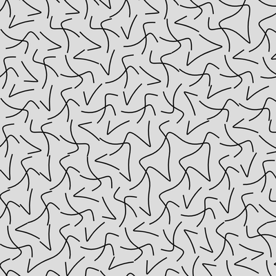
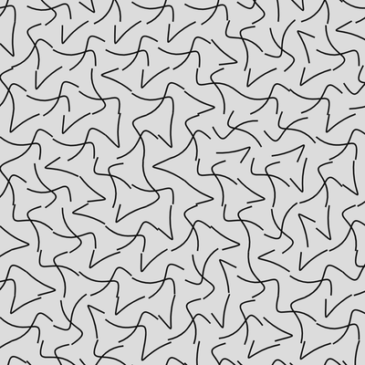

# Hexagons

`Hex... hex!`

## Try it here: [lorenzoros.si/HEXAGONS](https://www.lorenzoros.si/HEXAGONS)

## The idea

Did you know that you can fill a plane just using hexagons? It's one of the three regular polygons *(together with squares and triangles)* that have this special feature. John Conway, the legendary British mathematician who also invented Game of Life, called a plane divided into hexagons a *hextile*.

Having played Civilization V for more than 600 hours, I decided that I wanted to give it a go. *Is there a way I could making anything interesting with this kind of concept?*

## The coding phase

So with this half-plan in mind, I opened up my favourite editor (VScode, I'm too scared to try vim) and then promptly cloned my *always-growing, always-improving* [small canvas boilerplate](https://github.com/lorossi/empty-html5-canvas-project).

I started playing around with hexagons, moving them, determined to not stop until I had something fully working on my GitHub profile. **It took me a good hour just to find a way to place them in a grid.** Luckily, there are [some good people out there always ready to teach you for free.](https://www.redblobgames.com/grids/hexagons/).

Once able to get over this first huge step, it was time to put some *creativity* in this *creative code*. First I tried giving different colors to each hexagon, then I started connecting the midpoints of each side and rotating the whole figure. *The lines would always connect!* I was amazed. Who would have thought that? *anybody with half a brain, to be honest.*

At that point the path was set, but straight lines were not cutting it. Thing is, there's no easy way to trace a curve using JS on canvas. I looked deeply into *Catmull-Rom splines* and their relative implementations, but I couldn't really make it work. The lines were way too wonky and not harmonious enough.

So I did what any other reasonable programmer would have done: *I quit.*

## More coding

After a few days I picked up the project again. Encouraged by the prospect of making it work (look mom I almost have 150 followers on Instagram!), I started going through the Mozilla foundation [web docs](https://developer.mozilla.org/en-US/docs/Web/API/Canvas_API) and quickly found many different ways to draw curves.

Of course arcs were not going to make it real (too boring, too regular), so I quickly tried *quadratic* and *Bézier* curves. The first solution, once again, was not going to work. The lines connected in a strange way with the sides and I was not able to move around the way I wanted. But with *Bézier curves...* Boy oh boy.

*Look at me, getting all emotional and excited talking about curves!* I found out that they worked majestically and I could even add some randomness to each "scene" (set of hexagons) by moving around control points, creating tighter or rounder curves.

I managed to create some "exchanges" between the sides, meaning that each side will be connected to another, randomly picked, side by a Bézier curve. Rotating every hexagon does not break the feeling of a grid and you almost can't tell the difference between one grid and the one generated before it. Another feature that I wanted was that every video has to loop flawlessly. This means that the **starting and ending state for each hexagon had to be the same.**

How could I do it? By using [simplex noise](https://github.com/jwagner/simplex-noise.js/), of course.

## Chapter 3 - no more coding

I quickly added recording capabilities and a simple way of generating "states" (rotations) that each hexagon could assume. All that I needed now was a way to record and... *voilà!* Another project was complete.

I really had fun making this one, and I finally made an old idea of mine come true. It feels so good pushing that last one commit!

## But why?

Oh. I don't really know. I get easily bored.

## Output

As always, check my [Instagram profile](https://www.instagram.com/lorossi97/) to see this project in action. If you're not feeling it, either clone the repo to view the full quality videos or scroll a little bit to have a look at some choppy GIFs. *(when will GitHub start supporting videos?)*. Also, if you're adventurous, check [this link](https://www.lorenzoros.si/HEXAGONS) to also try it out.

### Stills

 

 

 

 

### GIFs

 

 

## Credits

Font used: [Hack.](https://sourcefoundry.org/hack/)

This project is distributed under Attribution 4.0 International (CC BY 4.0) license.
